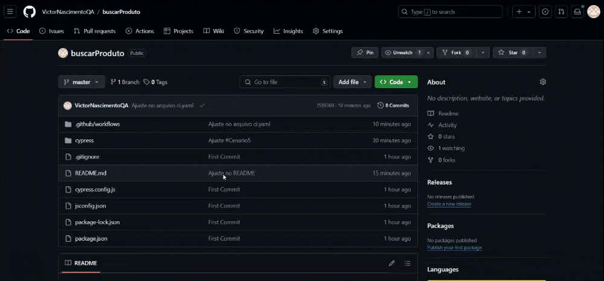

# BuscarProduto
Escolha do ambiente de testes
https://www.magazineluiza.com.br/

## User Story: Buscar Produto

Título: Como cliente da Amazon, eu quero buscar produtos na plataforma, para que eu possa encontrar rapidamente os itens que desejo comprar.

História do Usuário:
- Como um cliente da Amazon
- Eu quero poder buscar produtos utilizando palavras-chave, categorias ou filtros
- Para que eu possa encontrar facilmente os itens que estou interessado e agilizar minha compra.

## Critérios de aceite:

1. Campo de Busca Visível:
   - O campo de busca deve ser facilmente visível e acessível na parte superior de todas as páginas do site.
   - O usuário deve ser capaz de inserir palavras-chave, nome de produto, marca ou categoria.

2. Busca por Palavras-Chave:
   - O usuário deve poder buscar produtos inserindo palavras-chave relacionadas ao produto (ex: "celular", "sofá", "smartwatch").

3. Sugestões de Busca:
   - Enquanto o usuário digita no campo de busca, o sistema deve sugerir produtos ou categorias relacionadas.
   - As sugestões devem ser exibidas em um menu suspenso para facilitar a escolha do produto desejado.

4. Busca por Categoria ou Marca:
   - O usuário deve poder selecionar uma categoria de produtos (ex: Eletrônicos, Móveis, Moda) ou uma marca específica (ex: Samsung, Apple) como filtro de pesquisa.
   - O sistema deve exibir produtos filtrados de acordo com a categoria ou marca escolhida.

5. Exibição de Resultados:
   - O sistema deve exibir os resultados da busca de forma clara e organizada, com:
     - Nome do produto
     - Imagem do produto
     - Preço
     - Avaliações de clientes (se aplicável)
   - Os resultados devem ser classificados por relevância ou por outros filtros como preço ou avaliação.

6. Filtros de Busca:
   - Após realizar a busca, o usuário deve poder refinar os resultados utilizando filtros adicionais:
     - Faixa de preço
     - Avaliação (ex: 4 estrelas e acima)
     - Disponibilidade (ex: em estoque)
     - Opções de entrega (ex: frete grátis, entrega rápida)

7. Página de Detalhes do Produto:
   - Ao clicar em um item, o usuário deve ser redirecionado para a página de detalhes do produto, onde pode visualizar informações como descrição detalhada, especificações, imagens em alta resolução e avaliações de outros usuários.

8. Mensagens de Erro e Não Encontrado:
   - Caso a busca não retorne nenhum resultado, o sistema deve exibir uma mensagem de erro amigável, como: "Nenhum produto encontrado para sua pesquisa. Tente palavras-chave diferentes ou filtre por categoria."

9. Responsividade:
   - A funcionalidade de busca deve ser responsiva, funcionando de maneira eficiente tanto na versão desktop quanto na versão mobile.

10. Segurança:
    - O sistema deve tratar os dados de busca de maneira segura, sem coletar informações pessoais do usuário durante a pesquisa.

# Test Cases
## Feature: Buscar Produto na Amazon

  ### Cenário 1: Buscar produto por palavra-chave  
  ```gherkin 
  Scenario: Buscar produto por palavra-chave no campo de busca  
    Given que o usuário está na página inicial da Amazon  
    When o usuário digita "smartphone" no campo de busca e pressiona Enter  
    Then o sistema deve exibir uma lista de produtos relacionados ao termo "smartphone"  
    And cada produto deve exibir o nome, imagem, preço e avaliação  
```

  ### Cenário 2: Buscar produto com sugestões automáticas  
  ```gherkin 
  Scenario: Buscar produto com sugestões automáticas enquanto digita  
    Given que o usuário está na página inicial da Amazon  
    When o usuário começa a digitar "notebook" no campo de busca  
    Then o sistema deve exibir sugestões automáticas relacionadas, como "notebook Dell", "notebook Lenovo", etc.  
    And o usuário pode selecionar uma sugestão para refinar a busca  
```

  ### Cenário 3: Buscar produto por categoria
  ```gherkin 
  Scenario: Buscar produto filtrando por categoria  
    Given que o usuário está na página inicial da Amazon  
    When o usuário seleciona a categoria "Eletrônicos" no menu de categorias  
    Then o sistema deve exibir uma lista de produtos dentro da categoria "Eletrônicos"  
    And cada produto deve exibir o nome, imagem, preço e avaliação  
```

  ### Cenário 4: Buscar produto filtrando por faixa de preço
  ```gherkin 
  Scenario: Buscar produto filtrando por faixa de preço  
    Given que o usuário realizou uma busca por "smartphone"  
    When o usuário aplica o filtro de preço entre R$ 1.000 e R$ 2.000  
    Then o sistema deve exibir apenas os smartphones dentro da faixa de preço selecionada  
    And o preço de cada produto exibido deve estar dentro da faixa de R$ 1.000 a R$ 2.000  
```

  ### Cenário 5: Buscar produto filtrando por avaliação
  ```gherkin 
  Scenario: Buscar produto filtrando por avaliação mínima  
    Given que o usuário realizou uma busca por "smartphone"  
    When o usuário aplica o filtro de avaliação "4 estrelas e acima"  
    Then o sistema deve exibir apenas smartphones com avaliação igual ou superior a 4 estrelas  
```

  ### Cenário 6: Buscar produto sem resultados
  ```gherkin 
  Scenario: Buscar produto sem resultados  
    Given que o usuário está na página de busca  
    When o usuário digita "produto_inexistente" no campo de busca e pressiona Enter  
    Then o sistema deve exibir a mensagem "Nenhum produto encontrado"  
    And o sistema deve sugerir ao usuário tentar palavras-chave diferentes ou explorar outras categorias  
```

  ### Cenário 7: Buscar produto e visualizar os detalhes do produto
  ```gherkin 
  Scenario: Visualizar detalhes do produto ao clicar no item da busca  
    Given que o usuário está na página de resultados de busca  
    When o usuário clica em um produto da lista  
    Then o sistema deve redirecionar o usuário para a página de detalhes do produto  
    And a página de detalhes deve exibir informações como descrição, especificações, imagens e avaliações  
```

  ### Cenário 8: Buscar produto com filtro de disponibilidade
  ```gherkin 
  Scenario: Buscar produto filtrando por disponibilidade  
    Given que o usuário realizou uma busca por "smartphone"  
    When o usuário aplica o filtro de disponibilidade "Em estoque"  
    Then o sistema deve exibir apenas os smartphones que estão disponíveis para compra no estoque  
```

  ### Cenário 9: Buscar produto com filtro de entrega rápida
  ```gherkin 
  Scenario: Buscar produto filtrando por entrega rápida  
    Given que o usuário realizou uma busca por "televisão"  
    When o usuário aplica o filtro de "Entrega rápida"  
    Then o sistema deve exibir apenas as televisões com opção de entrega rápida  
    And a descrição de cada produto deve indicar que ele tem a opção de entrega rápida  
```

  ### Cenário 10: Verificar a responsividade da busca em dispositivos móveis
  ```gherkin 
  Scenario: Buscar produto em dispositivo móvel  
    Given que o usuário acessa a página da Amazon em um dispositivo móvel  
    When o usuário digita "lavadora de roupa" no campo de busca e pressiona Enter  
    Then o sistema deve exibir a lista de resultados de busca de forma responsiva  
    And o layout deve ser ajustado para uma visualização ideal em telas menores  
```

  ### Cenário 11: Buscar produto com múltiplos filtros aplicados
  ```gherkin  
  Scenario: Buscar produto com múltiplos filtros aplicados  
    Given que o usuário realizou uma busca por "smartphone"  
    When o usuário aplica os filtros de faixa de preço "R$ 1.000 - R$ 2.000", avaliação "4 estrelas e acima", e "Em estoque"  
    Then o sistema deve exibir apenas smartphones que atendam a todos os filtros aplicados  
    And o sistema deve mostrar o nome, imagem, preço e avaliação de cada produto
```

## Estimativa do tempo de testes:

1. Estimativa Baseada em Casos de Teste

Estimativa do Tempo por Caso de Teste
- Casos simples de verificação (ex: busca por palavra-chave) podem levar entre 10 e 15 minutos.
- Casos mais complexos (ex: teste de filtros múltiplos ou responsividade) podem levar entre 20 e 30 minutos.

Total de Casos de Teste
- Número de cenários de teste: 11
- Estimativa de tempo por cenário: 20 minutos

Cálculo do tempo estimado para 11 cenários:
11 cenários * 20 minutos = 220 minutos (ou 3 horas e 40 minutos)

Considerar possiveis ajustes para Regressões e Verificações Adicionais
- Adicionando 25% para testes de regressão, verificações adicionais e relatórios, temos:
220 minutos * 1.25 = 275 minutos (ou 4 horas e 35 minutos)

2. Estimativa Total de Tempo de Testes
Estimativa total considerando os cenários de teste e ajustes:
- Total estimado: **275 minutos (aproximadamente 4 horas e 35 minutos)**

Este tempo inclui:
- Execução dos testes manuais para os 11 cenários de busca
- Testes de regressão, se necessário
- Testes adicionais como responsividade
- Tempo para relatório e documentação dos resultados

Notas Adicionais:
- **Ambientes de Teste**: Se houver múltiplos ambientes (desenvolvimento, homologação e produção), pode ser necessário mais tempo para validações entre os ambientes.
- **Testes Repetitivos**: O tempo pode aumentar se houver a necessidade de repetir os testes para garantir a qualidade entre versões.
- **Testes Exploratório**: A equipe pode precisar de tempo extra para testes exploratórios, identificando falhas não previstas pelos cenários.

# Notas
O arquivo de pipeline CI/CD do projeto encontra-se em .github/workflows

